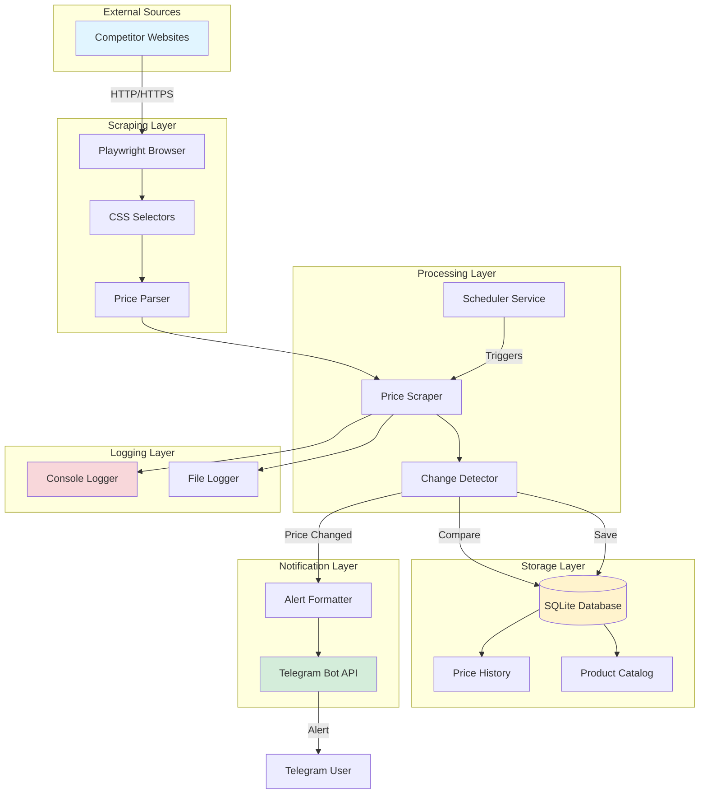

# Technical Architecture - Competitor Price Monitor

## System Overview

```
┌─────────────────────────────────────────────────────────────────────────┐
│                        COMPETITOR PRICE MONITOR                         │
│                     Real-time Price Tracking System                     │
└─────────────────────────────────────────────────────────────────────────┘
```

## High-Level Architecture



## Detailed Component Architecture

```
┌─────────────────────────────────────────────────────────────────────────┐
│                              INPUT LAYER                                │
├─────────────────────────────────────────────────────────────────────────┤
│                                                                         │
│  ┌──────────────────┐      ┌──────────────────┐                       │
│  │  Configuration   │      │   Environment    │                       │
│  │  (YAML/JSON)     │      │   Variables      │                       │
│  │                  │      │   (.env)         │                       │
│  │  • Product URLs  │      │  • API Keys      │                       │
│  │  • Selectors     │      │  • Bot Tokens    │                       │
│  │  • Competitors   │      │  • Chat IDs      │                       │
│  └──────────────────┘      └──────────────────┘                       │
│                                                                         │
└─────────────────────────────────────────────────────────────────────────┘
                                    │
                                    ▼
┌─────────────────────────────────────────────────────────────────────────┐
│                        ORCHESTRATION LAYER                              │
├─────────────────────────────────────────────────────────────────────────┤
│                                                                         │
│  ┌──────────────────────────────────────────────────────────────────┐  │
│  │                    Scheduler Service                              │  │
│  │                                                                   │  │
│  │  Modes:                                                           │  │
│  │  • --once      (Single execution)                                 │  │
│  │  • --daemon    (Continuous monitoring with interval)              │  │
│  │                                                                   │  │
│  │  Flow:                                                            │  │
│  │  1. Initialize database                                           │  │
│  │  2. Load configuration                                            │  │
│  │  3. Trigger scrape cycle                                          │  │
│  │  4. Process results                                               │  │
│  │  5. Send notifications                                            │  │
│  │  6. Sleep (daemon mode) or Exit (once mode)                       │  │
│  └──────────────────────────────────────────────────────────────────┘  │
│                                                                         │
└─────────────────────────────────────────────────────────────────────────┘
                                    │
                                    ▼
┌─────────────────────────────────────────────────────────────────────────┐
│                          SCRAPING LAYER                                 │
├─────────────────────────────────────────────────────────────────────────┤
│                                                                         │
│  ┌────────────────────────────────────────────────────────────────┐    │
│  │                    Price Scraper Engine                         │    │
│  │                                                                 │    │
│  │  ┌──────────────┐      ┌──────────────┐      ┌─────────────┐  │    │
│  │  │   Browser    │──────▶   Selector   │──────▶   Parser    │  │    │
│  │  │  (Playwright)│      │   Matching   │      │  (Regex)    │  │    │
│  │  └──────────────┘      └──────────────┘      └─────────────┘  │    │
│  │         │                      │                      │        │    │
│  │         ▼                      ▼                      ▼        │    │
│  │  • Headless mode        • CSS selectors       • Price clean   │    │
│  │  • User-agent           • Multiple tries      • Currency      │    │
│  │  • Wait for load        • Fallback logic      • Validation    │    │
│  │                                                                │    │
│  │  Output:                                                       │    │
│  │  {                                                             │    │
│  │    "product_id": "book-1",                                     │    │
│  │    "price": 51.77,                                             │    │
│  │    "currency": "USD",                                          │    │
│  │    "success": true,                                            │    │
│  │    "error": null                                               │    │
│  │  }                                                             │    │
│  └────────────────────────────────────────────────────────────────┘    │
│                                                                         │
└─────────────────────────────────────────────────────────────────────────┘
                                    │
                                    ▼
┌─────────────────────────────────────────────────────────────────────────┐
│                       DATA PROCESSING LAYER                             │
├─────────────────────────────────────────────────────────────────────────┤
│                                                                         │
│  ┌────────────────────────────────────────────────────────────────┐    │
│  │                  Change Detection Logic                         │    │
│  │                                                                 │    │
│  │  1. Fetch latest price from database                           │    │
│  │  2. Compare with newly scraped price                           │    │
│  │  3. Calculate change percentage                                │    │
│  │  4. Apply threshold filter (if configured)                     │    │
│  │  5. Determine change type:                                     │    │
│  │     • new_product    (first time seeing this product)          │    │
│  │     • price_up       (price increased)                         │    │
│  │     • price_down     (price decreased)                         │    │
│  │     • no_change      (price unchanged)                         │    │
│  │                                                                 │    │
│  │  Output:                                                        │    │
│  │  {                                                              │    │
│  │    "type": "price_change",                                      │    │
│  │    "old_price": 52.00,                                          │    │
│  │    "new_price": 51.77,                                          │    │
│  │    "change_percent": -0.44,                                     │    │
│  │    "direction": "down"                                          │    │
│  │  }                                                              │    │
│  └────────────────────────────────────────────────────────────────┘    │
│                                                                         │
└─────────────────────────────────────────────────────────────────────────┘
                                    │
                                    ▼
┌─────────────────────────────────────────────────────────────────────────┐
│                          STORAGE LAYER                                  │
├─────────────────────────────────────────────────────────────────────────┤
│                                                                         │
│  ┌────────────────────────────────────────────────────────────────┐    │
│  │                    SQLite Database                              │    │
│  │                                                                 │    │
│  │  Table: prices                                                  │    │
│  │  ┌──────────────────────────────────────────────────────────┐  │    │
│  │  │  Column            │ Type      │ Description             │  │    │
│  │  ├────────────────────┼───────────┼─────────────────────────┤  │    │
│  │  │  id                │ INTEGER   │ Primary key             │  │    │
│  │  │  competitor_name   │ TEXT      │ Source website          │  │    │
│  │  │  product_id        │ TEXT      │ Product identifier      │  │    │
│  │  │  product_name      │ TEXT      │ Product name            │  │    │
│  │  │  price             │ REAL      │ Numeric price           │  │    │
│  │  │  currency          │ TEXT      │ USD/EUR/GBP             │  │    │
│  │  │  stock_status      │ TEXT      │ In stock/Out of stock   │  │    │
│  │  │  url               │ TEXT      │ Product page URL        │  │    │
│  │  │  scraped_at        │ TIMESTAMP │ Scrape time             │  │    │
│  │  └──────────────────────────────────────────────────────────┘  │    │
│  │                                                                 │    │
│  │  Indexes:                                                       │    │
│  │  • idx_product_id  (for fast lookups)                          │    │
│  │  • idx_scraped_at  (for time-based queries)                    │    │
│  │                                                                 │    │
│  │  Operations:                                                    │    │
│  │  • save_price()          - Insert new record                   │    │
│  │  • get_latest_price()    - Fetch most recent                   │    │
│  │  • get_price_history()   - Historical data                     │    │
│  │  • detect_price_change() - Compare and analyze                 │    │
│  └────────────────────────────────────────────────────────────────┘    │
│                                                                         │
└─────────────────────────────────────────────────────────────────────────┘
                                    │
                                    ▼
┌─────────────────────────────────────────────────────────────────────────┐
│                      NOTIFICATION LAYER                                 │
├─────────────────────────────────────────────────────────────────────────┤
│                                                                         │
│  ┌────────────────────────────────────────────────────────────────┐    │
│  │                  Telegram Bot Integration                       │    │
│  │                                                                 │    │
│  │  ┌──────────────────┐                                          │    │
│  │  │ Alert Formatter  │                                          │    │
│  │  ├──────────────────┤                                          │    │
│  │  │ Template:        │                                          │    │
│  │  │                  │                                          │    │
│  │  │ 📉 PRICE DROP    │                                          │    │
│  │  │                  │                                          │    │
│  │  │ Product: Book 1  │                                          │    │
│  │  │ Competitor: ABC  │                                          │    │
│  │  │                  │                                          │    │
│  │  │ Old: $52.00      │                                          │    │
│  │  │ New: $51.77      │                                          │    │
│  │  │ Change: -0.44%   │                                          │    │
│  │  │                  │                                          │    │
│  │  │ [View Product]   │                                          │    │
│  │  └──────────────────┘                                          │    │
│  │           │                                                     │    │
│  │           ▼                                                     │    │
│  │  ┌──────────────────┐                                          │    │
│  │  │  Telegram API    │                                          │    │
│  │  │  POST /sendMessage                                          │    │
│  │  │                  │                                          │    │
│  │  │  {               │                                          │    │
│  │  │    "chat_id": "...",                                        │    │
│  │  │    "text": "...",                                           │    │
│  │  │    "parse_mode": "Markdown"                                 │    │
│  │  │  }               │                                          │    │
│  │  └──────────────────┘                                          │    │
│  │           │                                                     │    │
│  │           ▼                                                     │    │
│  │    [User's Phone]                                              │    │
│  └────────────────────────────────────────────────────────────────┘    │
│                                                                         │
└─────────────────────────────────────────────────────────────────────────┘
                                    │
                                    ▼
┌─────────────────────────────────────────────────────────────────────────┐
│                         LOGGING LAYER                                   │
├─────────────────────────────────────────────────────────────────────────┤
│                                                                         │
│  ┌────────────────────────────────┬──────────────────────────────────┐ │
│  │      Console Logger            │       File Logger                │ │
│  ├────────────────────────────────┼──────────────────────────────────┤ │
│  │                                │                                  │ │
│  │  • Colorama for colors         │  • Daily rotation                │ │
│  │  • Unicode icons (✓ ⚠ ✗)       │  • UTF-8 encoding                │ │
│  │  • Real-time feedback          │  • Full stack traces             │ │
│  │  • User-friendly format        │  • Timestamps                    │ │
│  │                                │  • DEBUG level details           │ │
│  │  Output:                       │                                  │ │
│  │  [2026-01-28 00:51:41]         │  File: logs/price_monitor_*.log  │ │
│  │  [INFO] ✓ Scraping...          │  Format: [time][level][msg]      │ │
│  │                                │                                  │ │
│  └────────────────────────────────┴──────────────────────────────────┘ │
│                                                                         │
└─────────────────────────────────────────────────────────────────────────┘
```

## Data Flow Diagram

```
┌──────────┐
│  START   │
└────┬─────┘
     │
     ▼
┌─────────────────────────────────┐
│ Load Configuration              │
│ • Read YAML (competitors)       │
│ • Read .env (credentials)       │
└────┬────────────────────────────┘
     │
     ▼
┌─────────────────────────────────┐
│ Initialize Database             │
│ • Create tables if not exist    │
│ • Create indexes                │
└────┬────────────────────────────┘
     │
     ▼
┌─────────────────────────────────┐
│ For Each Competitor:            │
│ ┌──────────────────────────┐    │
│ │ For Each Product:        │    │
│ │ ├─ Launch Browser        │    │
│ │ ├─ Navigate to URL       │    │
│ │ ├─ Extract Price         │    │
│ │ ├─ Parse & Validate      │    │
│ │ └─ Return Result         │    │
│ └──────────────────────────┘    │
└────┬────────────────────────────┘
     │
     ▼
┌─────────────────────────────────┐
│ Process Each Result:            │
│ ┌──────────────────────────┐    │
│ │ Fetch last price from DB │    │
│ │         ▼                │    │
│ │ Compare new vs old       │    │
│ │         ▼                │    │
│ │ Calculate % change       │    │
│ │         ▼                │    │
│ │ Save to database         │    │
│ └──────────────────────────┘    │
└────┬────────────────────────────┘
     │
     ├──────────┬──────────────┐
     ▼          ▼              ▼
  ┌──────┐  ┌────────┐   ┌──────────┐
  │ No   │  │ Price  │   │  New     │
  │Change│  │Changed │   │ Product  │
  └──────┘  └───┬────┘   └────┬─────┘
                │              │
                ▼              ▼
         ┌──────────────────────────┐
         │ Format Notification      │
         │ • Product details        │
         │ • Price comparison       │
         │ • % change               │
         │ • Product URL            │
         └────┬─────────────────────┘
              │
              ▼
         ┌──────────────────────────┐
         │ Send to Telegram         │
         │ • Bot API call           │
         │ • Markdown formatting    │
         │ • Retry on failure       │
         └────┬─────────────────────┘
              │
              ▼
         ┌──────────────────────────┐
         │ Log Activity             │
         │ • Console (colored)      │
         │ • File (detailed)        │
         └──────────────────────────┘
                │
                ▼
         ┌──────────────────────────┐
         │ Mode Check               │
         ├──────────┬───────────────┤
         │ --once   │   --daemon    │
         ▼          ▼               │
      ┌──────┐  ┌────────┐         │
      │ EXIT │  │ Sleep  │◄────────┘
      └──────┘  │interval│
                └───┬────┘
                    │
                    └──► (Loop back to "For Each Competitor")
```

## Technology Stack

```
┌─────────────────────────────────────────────────────────────┐
│                     TECHNOLOGY STACK                        │
├─────────────────────────────────────────────────────────────┤
│                                                             │
│  Language & Runtime:                                        │
│  • Python 3.12+                                             │
│                                                             │
│  Web Scraping:                                              │
│  • Playwright (browser automation)                          │
│  • Chromium (headless browser)                              │
│                                                             │
│  HTTP Client:                                               │
│  • httpx (async/sync HTTP)                                  │
│                                                             │
│  Database:                                                  │
│  • SQLite (embedded database)                               │
│  • Built-in Python support                                  │
│                                                             │
│  Messaging:                                                 │
│  • Telegram Bot API                                         │
│  • HTTPS REST endpoints                                     │
│                                                             │
│  Configuration:                                             │
│  • python-dotenv (environment variables)                    │
│  • PyYAML (YAML parsing)                                    │
│                                                             │
│  Logging:                                                   │
│  • Python logging module                                    │
│  • colorama (cross-platform colors)                         │
│                                                             │
│  Deployment:                                                │
│  • Docker (containerization)                                │
│  • Docker Compose (orchestration)                           │
│                                                             │
└─────────────────────────────────────────────────────────────┘
```

## Deployment Architectures

### Local Development
```
┌─────────────────────────────┐
│   Developer Machine         │
│                             │
│  ┌──────────────────────┐   │
│  │  Python 3.12+        │   │
│  │  ├─ Virtual Env      │   │
│  │  ├─ Dependencies     │   │
│  │  └─ Playwright       │   │
│  └──────────────────────┘   │
│           │                 │
│           ▼                 │
│  ┌──────────────────────┐   │
│  │  Application         │   │
│  │  ├─ /execution       │   │
│  │  ├─ /config          │   │
│  │  └─ /data            │   │
│  └──────────────────────┘   │
│                             │
└─────────────────────────────┘
```

### Docker Deployment
```
┌─────────────────────────────────────────┐
│         Docker Host                     │
│                                         │
│  ┌───────────────────────────────────┐  │
│  │  Container: price-monitor         │  │
│  │                                   │  │
│  │  ┌─────────────────────────────┐  │  │
│  │  │  Application Layer          │  │  │
│  │  │  • Python runtime           │  │  │
│  │  │  • Dependencies             │  │  │
│  │  │  • Playwright + Chromium    │  │  │
│  │  └─────────────────────────────┘  │  │
│  │                                   │  │
│  │  Volumes:                         │  │
│  │  • /app/data  → ./data            │  │
│  │  • /app/logs  → ./logs            │  │
│  │  • /app/config → ./config         │  │
│  │                                   │  │
│  │  Environment:                     │  │
│  │  • From .env file                 │  │
│  │                                   │  │
│  │  Network:                         │  │
│  │  • Bridge mode                    │  │
│  │  • Outbound only                  │  │
│  └───────────────────────────────────┘  │
│                                         │
└─────────────────────────────────────────┘
```

### Cloud Deployment (AWS/GCP/Azure)
```
┌─────────────────────────────────────────────────────────┐
│                    Cloud Provider                       │
│                                                         │
│  ┌──────────────────────────────────────────────────┐   │
│  │  Container Service (ECS/Cloud Run/ACI)           │   │
│  │                                                  │   │
│  │  ┌────────────────────────────────────────────┐  │   │
│  │  │  price-monitor:latest                      │  │   │
│  │  │                                            │  │   │
│  │  │  Resources:                                │  │   │
│  │  │  • CPU: 1 vCPU                             │  │   │
│  │  │  • Memory: 1GB                             │  │   │
│  │  │  • Storage: 10GB (persistent)              │  │   │
│  │  └────────────────────────────────────────────┘  │   │
│  │                                                  │   │
│  │  Secrets Manager:                                │   │
│  │  • TELEGRAM_BOT_TOKEN                            │   │
│  │  • TELEGRAM_CHAT_ID                              │   │
│  │                                                  │   │
│  │  Scheduling:                                     │   │
│  │  • CloudWatch Events / Cloud Scheduler           │   │
│  │  • Cron: */30 * * * * (every 30 min)            │   │
│  └──────────────────────────────────────────────────┘   │
│                                                         │
└─────────────────────────────────────────────────────────┘
```

## Security Architecture

```
┌─────────────────────────────────────────────────────────┐
│                  SECURITY LAYERS                        │
├─────────────────────────────────────────────────────────┤
│                                                         │
│  1. Secrets Management:                                 │
│     • .env file (never committed)                       │
│     • Environment variables only                        │
│     • No hardcoded credentials                          │
│                                                         │
│  2. Network Security:                                   │
│     • HTTPS only for all external calls                 │
│     • Bot API over TLS                                  │
│     • No incoming ports required                        │
│                                                         │
│  3. Container Security (Docker):                        │
│     • Non-root user (appuser:1000)                      │
│     • Read-only filesystem (except volumes)             │
│     • Minimal base image (python:3.12-slim)             │
│     • No unnecessary packages                           │
│                                                         │
│  4. Data Security:                                      │
│     • SQLite with file permissions                      │
│     • No PII storage                                    │
│     • Logs exclude sensitive data                       │
│                                                         │
│  5. Access Control:                                     │
│     • Telegram chat_id whitelist                        │
│     • Bot token authentication                          │
│                                                         │
└─────────────────────────────────────────────────────────┘
```

## Performance Characteristics

```
┌─────────────────────────────────────────────────────────┐
│                    PERFORMANCE METRICS                  │
├─────────────────────────────────────────────────────────┤
│                                                         │
│  Scraping Speed:                                        │
│  • Text-based site: ~2-5 seconds per product            │
│  • JavaScript-heavy: ~5-10 seconds per product          │
│  • With images: +2 seconds                              │
│                                                         │
│  Database Operations:                                   │
│  • INSERT: <1ms                                         │
│  • SELECT (indexed): <1ms                               │
│  • History query (100 records): ~5ms                    │
│                                                         │
│  Memory Usage:                                          │
│  • Idle: ~50MB                                          │
│  • Browser active: ~200-500MB                           │
│  • Peak: ~800MB                                         │
│                                                         │
│  CPU Usage:                                             │
│  • Idle: <1%                                            │
│  • Scraping: 10-30%                                     │
│                                                         │
│  Network:                                               │
│  • Per scrape: ~100KB-2MB (depends on page)             │
│  • Telegram notification: ~1-5KB                        │
│                                                         │
│  Scalability:                                           │
│  • Supported products: 1,000+                           │
│  • Concurrent scrapes: 5-10 (browser pool)              │
│  • Database size: Unlimited (SQLite handles GB+)        │
│                                                         │
└─────────────────────────────────────────────────────────┘
```

## Error Handling & Resilience

```
┌─────────────────────────────────────────────────────────┐
│                 ERROR HANDLING STRATEGY                 │
├─────────────────────────────────────────────────────────┤
│                                                         │
│  Scraping Errors:                                       │
│  ├─ Timeout → Retry 3x with backoff                     │
│  ├─ Selector not found → Try fallback selectors         │
│  ├─ Parse error → Log and skip, continue with next      │
│  └─ Network error → Retry with exponential backoff      │
│                                                         │
│  Database Errors:                                       │
│  ├─ Connection error → Retry 3x                         │
│  ├─ Constraint violation → Log and skip                 │
│  └─ Disk full → Alert via Telegram                      │
│                                                         │
│  Notification Errors:                                   │
│  ├─ API timeout → Retry 3x                              │
│  ├─ Rate limit → Wait and retry                         │
│  ├─ Invalid token → Fatal error, stop daemon            │
│  └─ Network error → Queue for later                     │
│                                                         │
│  Logging:                                               │
│  ├─ Console error → Fallback to stderr                  │
│  ├─ File write error → Continue with console only       │
│  └─ Disk full → Rotate old logs                         │
│                                                         │
│  Recovery:                                              │
│  ├─ Graceful shutdown on SIGTERM/SIGINT                 │
│  ├─ State saved to database (no in-memory loss)         │
│  └─ Resume on restart (stateless design)                │
│                                                         │
└─────────────────────────────────────────────────────────┘
```
